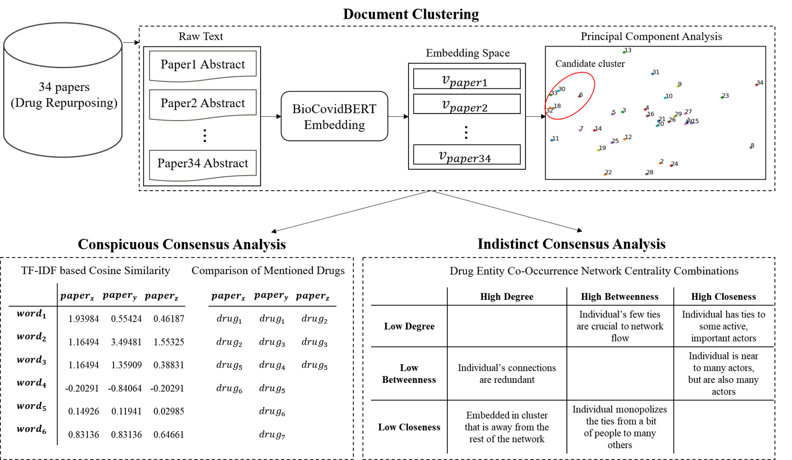

## [Information Extraction from Electronic Health Records using Semi-supervised Learning](https://namupark.github.io/projects/1/)

------

## [Consensus Analysis of Drug Repurposing Literatures for COVID-19](https://namupark.github.io/projects/2/)

------

## [Deep Learning based Steering Noise Classification](https://namupark.github.io/projects/3/)

------

## [Automatic Translation of Affiliations and Author Names in Research Papers using Attention](https://namupark.github.io/projects/4/)

------

## [A Curation System for Academic Papers using Paper2vec and BERT Embeddings](https://namupark.github.io/projects/5/)

------

## [Poisonous Clause Detection using Word Embedding and Sentence Similarity](https://namupark.github.io/projects/6/)

------

## [Text-mining based Consumer Analysis on Foldable Phones focusing on Galaxy Fold](https://namupark.github.io/projects/7/)

------

## [Rule-based Semantic Graph Analysis using Chat Log](https://namupark.github.io/projects/8/)

------

## [Violent Language Detection through Unstructured Big Data Analysis](https://namupark.github.io/projects/9/)

------

## [Sentimental Analysis of Cyber Campus data, focused on Group Assignment Discussion](https://namupark.github.io/projects/10/)

------

