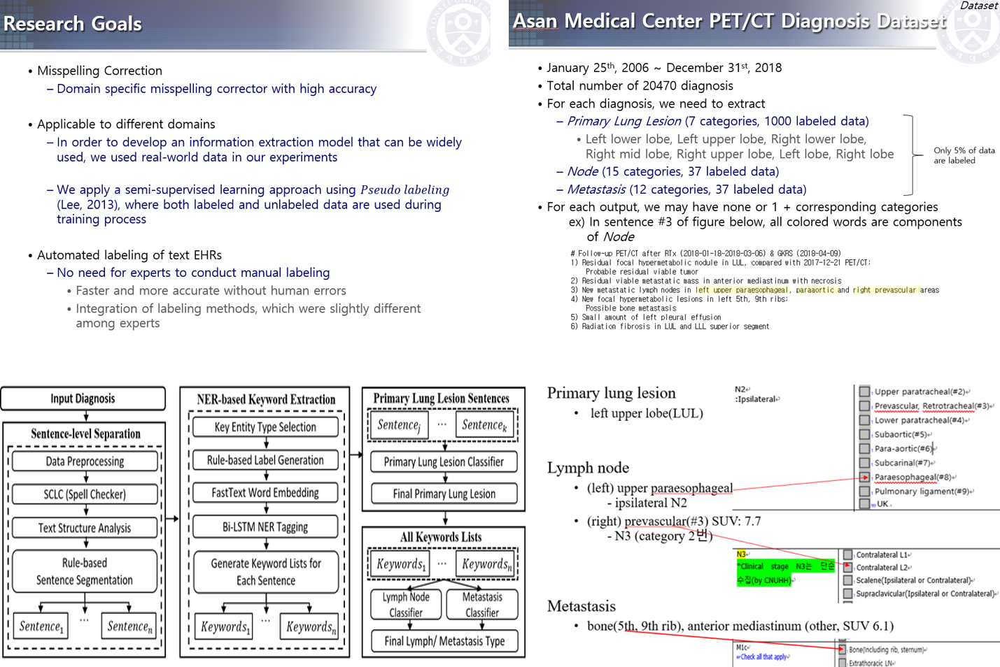
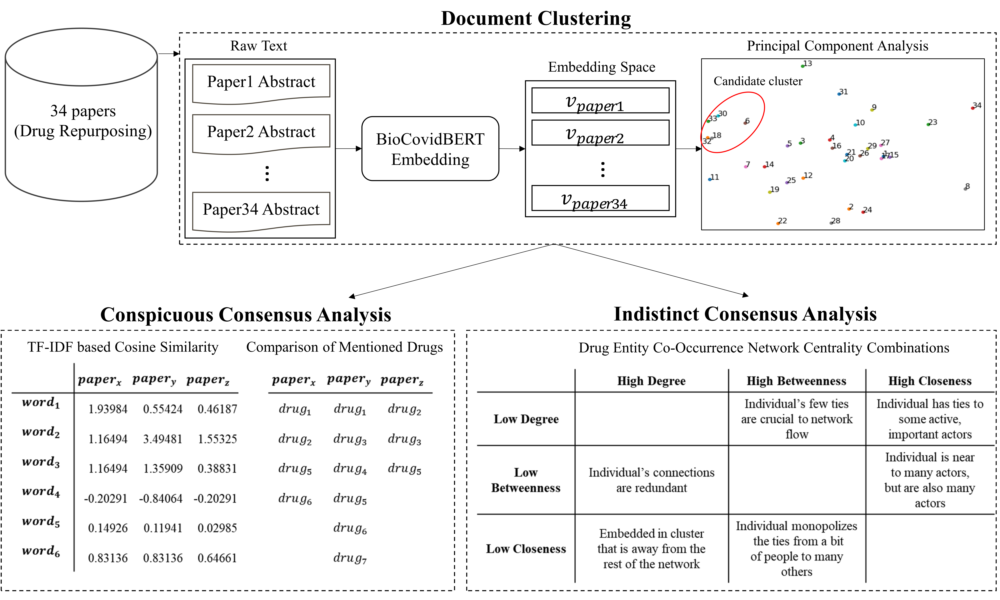
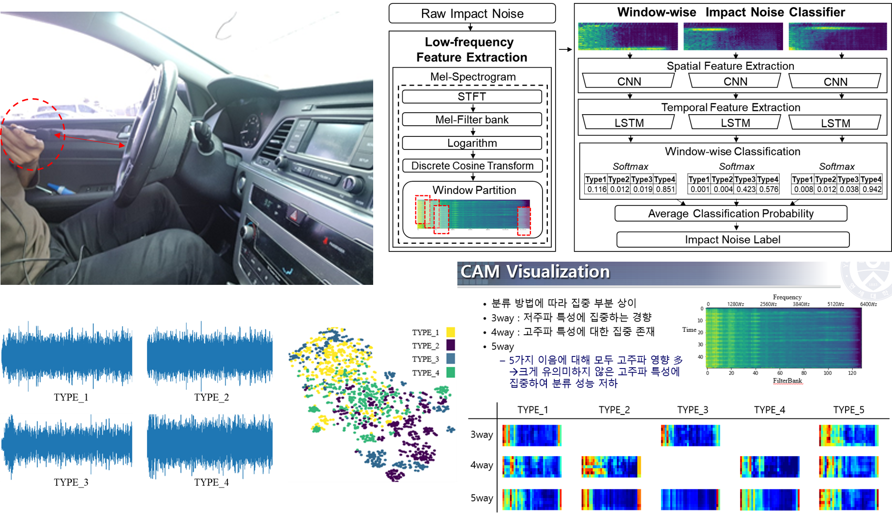
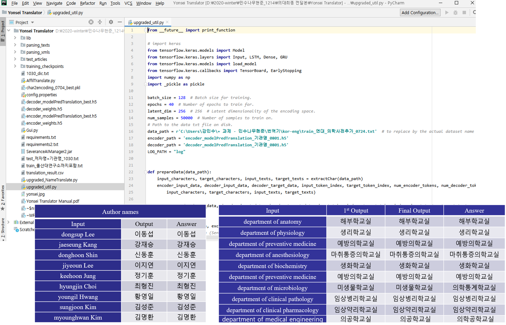
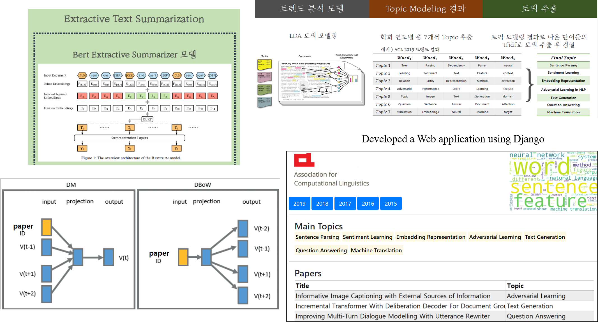
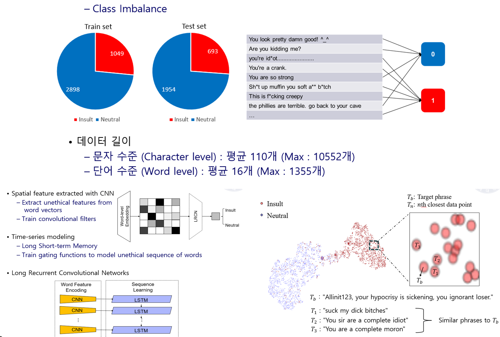
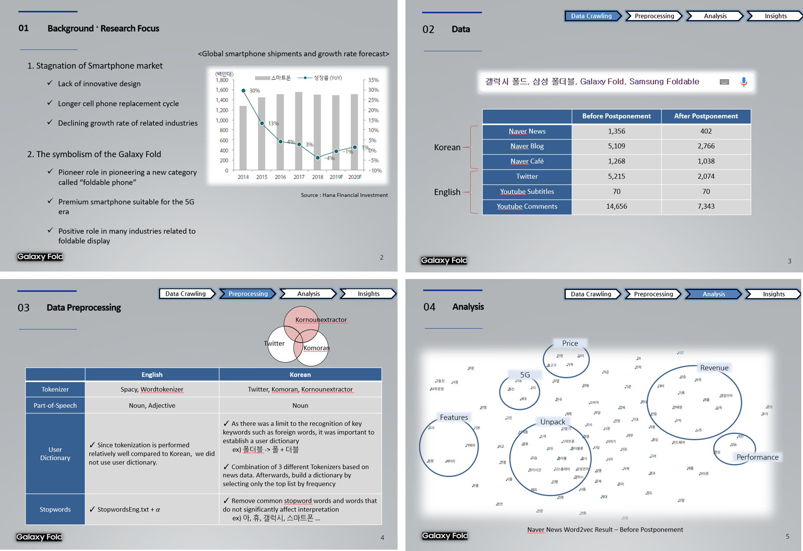
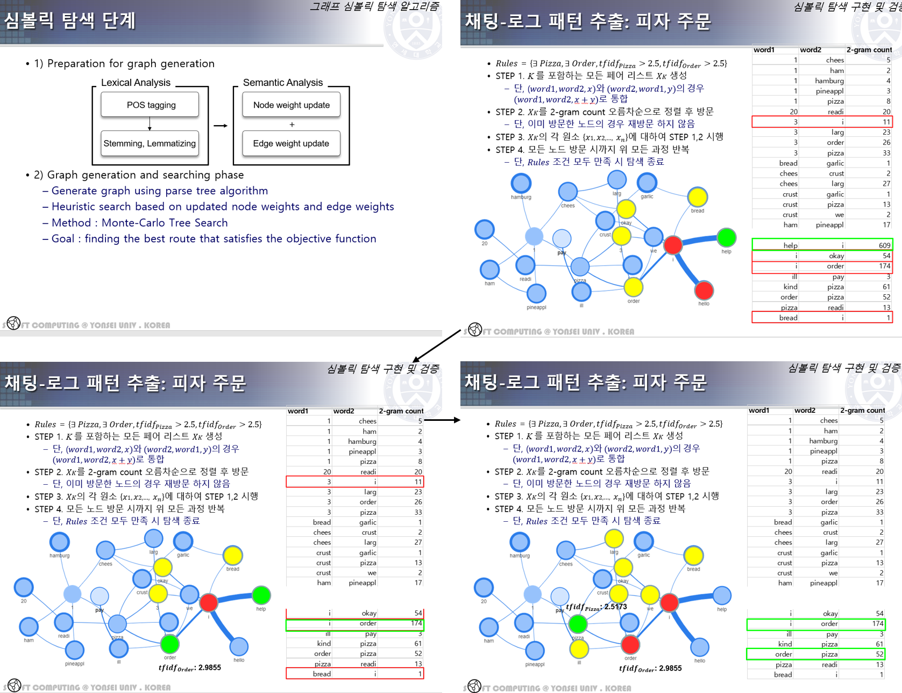
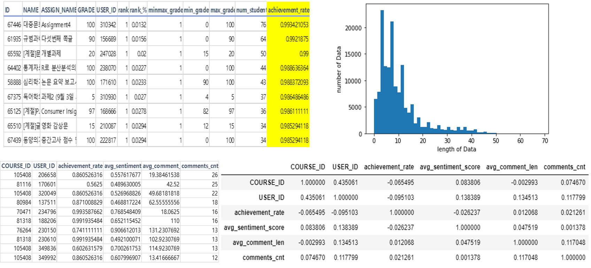

### [Development of the AI-based Cardiopulmonary Disease Prediction System using Biological Ring Sensors](https://namupark.github.io/projects/1/)

Implementing the deep learning-based prediction system to predict cardiopulmonary disease  
*at Asan Medical Center*   
{:height="66%" width="66%"}

------

### [Information Extraction from Electronic Health Records using Semi-supervised Learning](https://namupark.github.io/projects/1/)

Extracting metastasis information on PET/CT diagnosis data  
*with Asan Medical Center*   
{:height="66%" width="66%"}

------

### [Consensus Analysis of Drug Repurposing Literatures for COVID-19](https://namupark.github.io/projects/2/)

Observing the possible consensus among publications related to COVID-19 drug repurposing  
*with Professor Ying Ding, School of Information, University of Texas, Austin*  
{:height="66%" width="66%"}

------

### [Deep Learning based Steering Noise Classification](https://namupark.github.io/projects/3/)

Steering gear noise classification using Convolutional-Recurrent Neural Network  
*with Hyundai Mobis*  

{:height="66%" width="66%"}

------

### [Automatic Translation of Affiliations and Author Names in Research Papers using Attention](https://namupark.github.io/projects/4/)

Translating affiliation and author information in medical publications (ENG2KOR)  
*with College of Medicine, Yonsei University*  

{:height="66%" width="66%"}

------

### [A Curation System for Academic Papers using Paper2vec and BERT Embeddings](https://namupark.github.io/projects/5/)

Curation system that helps graduate students to search for publications of their interest  
*Fall 2019 course project for Natural Language Processing*  

{:height="66%" width="66%"}

------

### [Poisonous Clause Detection using Word Embedding and Sentence Similarity](https://namupark.github.io/projects/6/)

Detecting poisonous clause in a company  
*with Samsung Engineering*  

Below figure describes the algorithm used in this project, applied in a benchmark data (Kaggle Insult data)  
{:height="66%" width="66%"}

------

### [Text-mining based Consumer Analysis on Foldable Phones focusing on Galaxy Fold](https://namupark.github.io/projects/7/)

Illustrating the change in consumers' reaction after the delayed launching of the Galaxy Fold  
*Spring 2019 course project for Text Mining* 

{:height="66%" width="66%"}

------

### [Rule-based Semantic Graph Analysis using Chat Log](https://namupark.github.io/projects/8/)

Extracting user patterns using Monte-Carlo Tree Search algorithm in the semantic graph  
*with Electronics and Telecommunication Research Institute, Republic of Korea*

{:height="66%" width="66%"}

------

### [Sentimental Analysis of Cyber Campus data, focused on Group Assignment Discussion](https://namupark.github.io/projects/10/)

Checking the relationship between a student's participation in a group assignment and his/her final grade  
*with Teaching and Learning Innovation Center, Yonsei University*   

{:height="66%" width="66%"}